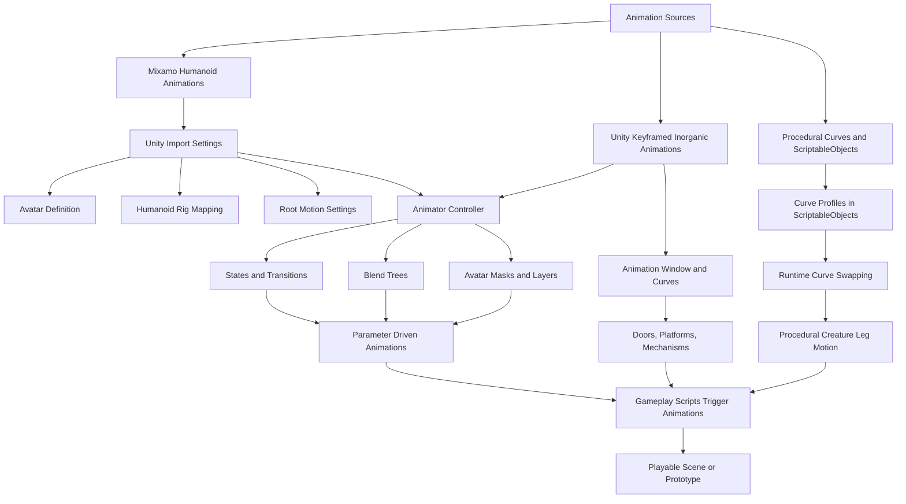

# **1. Module Overview**

## **1.1 What This Module Is About**

This module introduces students to **practical animation techniques for game development**, focusing on **low-complexity, high-impact workflows** that avoid the overhead of full custom character pipelines.
Instead of sculpting, retopology, UVs, and advanced rigging, students will work with **provided characters**, **Mixamo rigs**, **Unity’s animation system**, and **procedural + inorganic animation techniques** suitable for production-focused prototyping.

The goal is not to turn students into professional character animators.
The goal is to give them **practical, implementable skills** to bring life, motion, and responsiveness into their game projects.

---

## **1.2 Aims for Learners**

By the end of the module, students should be able to:

* Understand how animation integrates into a real-time game engine and what constraints this introduces.
* Import, configure, and retarget humanoid animations from external sources (e.g., Mixamo).
* Construct animation state machines and blend animations effectively for responsive gameplay.
* Design and implement inorganic animations (e.g., doors, platforms, mechanisms) using Unity’s animation tools and animation curves.
* Gain introductory experience with procedural animation workflows using ScriptableObjects and runtime curve manipulation.
* Combine multiple animation techniques into a small playable scene or micro-prototype.

---

## **1.3 Skills We Will Cover**

### **Humanoid Animation Skills**

* Using Mixamo to auto-rig meshes
* Applying and blending Mixamo animations in Unity
* Retargeting animations between different humanoid rigs
* Using Avatar Masks and animation layers for partial-body animation (upper/lower body splits)

### **Inorganic Animation Skills**

* Animating environment objects (doors, moving platforms, puzzle mechanisms)
* Using Unity’s Animation window and curve editor
* Creating looped, event-driven, and timeline-based motion
* Understanding root-motion vs in-place animation

### **Procedural Animation Foundations**

* Animating non-humanoid creatures with curve-driven motion
* Using ScriptableObjects to store animation curve profiles
* Swapping animation data at runtime (e.g., “damaged leg” behaviour)
* Blending procedural systems with keyframed animation

### **General Engine Animation Workflow**

* Building Animator Controllers and Blend Trees
* Triggering animations from code
* Understanding transitions, exit times, and parameters
* Debugging and testing animation behaviour in real time

---

## **1.4 Unity Animation Systems – Module Touchstone Map**

How the different animation workflows taught in this module connect together

## **1.5 What We Are *Not* Covering**

We are deliberately **not covering high-complexity character art, rigging, or advanced animation pipelines** because these require specialist tools, long production times, and prior expertise that sit outside the scope of this module. The focus here is on **practical, achievable animation workflows** that students can use immediately in game prototypes.

Students will see some of these advanced areas **conceptually**, but they are **not required for assessment** and are intentionally excluded to keep the module accessible, focused, and realistic within the available teaching weeks.

---

## **1.6 Practical Projects in the Semester**

Students will complete **two core practical projects** plus several **in-class micro-exercises**:

### **1) Animation Systems Mini-Scene (Weeks 5–9)**

A functional scene containing:

* A humanoid character using retargeted and blended animations
* At least one inorganic animated object (door/mechanism/platform)
* Some interaction demonstrating animation triggering

This focuses on demonstrating core competencies in **Mixamo → Unity workflow**, **Animator Controller design**, and **inorganic animation**.

---

### **2) Procedural Creature Animation Prototype (Weeks 10–12)**

* **Creature Path:** Implement the procedural alien leg system using curves and ScriptableObjects

This project emphasises **creativity**, **iteration**, and  procedural thinking with complex curve-based setup.

---

# **2. Week-by-Week Plan (Teaching Weeks 1–12)**

| Week   | Session Title                                                                          | 12 Principles (Theory Focus)                                  | Teacher   | What Problem Are We Solving?                                                                                 |
| ------ | -------------------------------------------------------------------------------------- | ------------------------------------------------------------- | --------- | ------------------------------------------------------------------------------------------------------------ |
| **1**  | Content TBC                                                                            | –                                                             | **Emily** | –                                                                                                            |
| **2**  | Content TBC                                                                            | –                                                             | **Emily** | –                                                                                                            |
| **3**  | Content TBC                                                                            | –                                                             | **Emily** | –                                                                                                            |
| **4**  | Content TBC                                                                            | –                                                             | **Emily** | –                                                                                                            |
| **5**  | **Humanoid Animation Pt. 1 – Mixamo Workflow & Unity Import Pipeline**                 | *Squash & Stretch*, *Pose-to-Pose*, *Timing*                  | **Rob**   | **“How do I get a character rigged and animated quickly without doing the whole character pipeline?”**       |
| **6**  | **Humanoid Animation Pt. 2 – Retargeting & Blend Trees**                               | *Anticipation*, *Follow-Through & Overlapping Action*, *Arcs* | **Rob**   | **“How do I reuse animations on different characters, and how do I blend them smoothly?”**                   |
| **7**  | **Inorganic Animation Pt. 1 – Doors, Platforms & Mechanisms**                          | *Slow In / Slow Out*, *Secondary Action*                      | **Rob**   | **“How do I animate objects and environments so they feel intentional and readable in gameplay?”**           |
| **8**  | **Inorganic Animation Pt. 2 – Curve-Driven Motion & Creative Timing**                  | *Exaggeration*, *Staging*                                     | **Rob**   | **“How do I use animation curves to control motion precisely and make mechanical movement feel impactful?”** |
| **9**  | **Animation Blending – Partial Body Masks & Layered Motion**                           | *Appeal*, *Solid Drawing*                                     | **Rob**   | **“How do I combine multiple animations at once, like walking + aiming, without them breaking?”**            |
| **10** | **Procedural Creature Animation Pt. 1 – Curve-Driven Leg Systems**                     | *(All principles covered — no new ones added)*                | **Rob**   | **“How do I animate a non-humanoid creature where I can't use an existing library?**                       |
| **11** | **Procedural Creature Animation Pt. 2 – Curve Profiles & Runtime Behaviour Switching** | *(All principles covered — no new ones added)*                | **Rob**   | **“How do I change a creature’s movement behaviour at runtime (e.g., damaged leg)?”**                        |
| **12** | **Final Integration – Building the Animated Game-Ready Mini-Prototype**                | *(All principles covered — no new ones added)*                | **Rob**   | **“How do I bring everything together into a single, believable animated scene ready for assessment?”**      |

---

