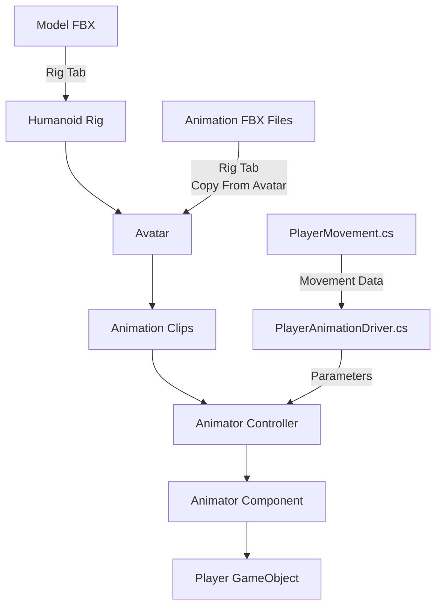

# Humanoid Animation Pt. 1

## Mixamo → Unity Animation Pipeline (Idle, Walk)

### Lab + Challenge/Homework

---

## Module Context

This lab introduces the **core Unity animation pipeline for pre-made humanoid characters**.
You will not be creating characters or animations from scratch.

Instead, you will learn how to:

* Acquire a rigged humanoid character and animations from Mixamo
* Configure them correctly in Unity
* Build a simple Animator Controller
* Drive animation using an existing player controller

This pipeline is reused throughout the semester. It is recomended that you take a good look at the documentation below and make some notes.

## Documentation/Links
[Animation Overview - Unity Docs](https://docs.unity3d.com/Manual/AnimationOverview.html)

[Humanoid Avatar - Unity Docs](https://docs.unity3d.com/Manual/AvatarCreationandSetup.html)

[Configuring The Avatar - Unity Docs](https://docs.unity3d.com/Manual/ConfiguringtheAvatar.html)

[The Animator Component](https://docs.unity3d.com/Manual/class-Animator.html)

[The Animator Controller](https://docs.unity3d.com/Manual/class-AnimatorController.html)


---

## Learning Objectives

By the end of this lab, you should be able to:

* Import a humanoid character and create a valid Avatar
* Retarget multiple animations onto the same humanoid rig
* Understand how Unity’s animation windows fit together
* Build a basic Animator Controller (Idle ↔ Walk)
* Drive animation state changes using code
* Extend the pipeline to support Jump (challenge)

---

## Core Question This Lab Solves

> How do I get a character rigged and animated quickly without doing the full character creation pipeline?

---

## The Unity Animation Pipeline (Big Picture)

Before touching assets, it is important to understand how Unity’s animation systems connect.

### Animation Pipeline Overview



### How to Read This

* **Model FBX** provides the mesh and skeleton
* **Avatar** is Unity’s internal humanoid mapping
* **Animation FBXs** contain motion only
* **Animator Controller** decides which animation plays
* **PlayerAnimationDriver** connects gameplay state to animation
* **PlayerMovement** does not play animations directly

Keep this flow in mind whenever something breaks.

---

## What You Are Given

* A Unity 3D URP project
* A provided package:

```
Teaching_CorePlayer_3D.unitypackage
```

This includes:

* A working `PlayerMovement.cs` script
* A basic player prefab with WASD movement

You should confirm movement works **before** starting the lab.

---

## What You Must Acquire (Mixamo)

From Mixamo you must download:

* 1 humanoid character model
* 3 animations:

  * Idle
  * Walk
  * Jump (used for the challenge)

---

## Suggested Folder Structure

```
Assets/
└── Teaching/
    ├── Characters/
    │   └── Mixamo/
    │       ├── Models/
    │       ├── Animations/
    │       ├── Controllers/
    │       └── Prefabs/
    └── Scripts/
```

Keeping assets organised avoids import and retargeting errors.

---

# Part 0 – Project Setup

### Step 0.1 Import the Teaching Package

1. Open the Unity project.
2. Import `Teaching_CorePlayer_3D.unitypackage`.
3. Locate the provided player prefab or scene.
4. Enter Play Mode and confirm:

   * WASD movement works
   * No errors appear in the Console

**Checkpoint:**
You can move the player character before adding animation.

---

# Part 1 – Acquire Assets From Mixamo

## Step 1.1 Download the Character Model

On Mixamo:

* Select a humanoid character
* Download settings:

  * Format: FBX for Unity
  * Skin: With Skin
  * Pose: T-Pose (recommended)

Name example:

```
Mixamo_Character.fbx
```

Place in:

```
Assets/Teaching/Characters/Mixamo/Models
```

---

## Step 1.2 Download the Animations

Download three animations:

### Idle

* Format: FBX for Unity
* Skin: Without Skin

### Walk

* Format: FBX for Unity
* Skin: Without Skin
* In Place: Enabled (recommended)

### Jump

* Format: FBX for Unity
* Skin: Without Skin

Name examples:

```
Mixamo_Idle.fbx
Mixamo_Walk.fbx
Mixamo_Jump.fbx
```

Place in:

```
Assets/Teaching/Characters/Mixamo/Animations
```

**Checkpoint:**
You have one model FBX and three animation FBXs in the correct folders.

---

# Part 2 – Humanoid Rig & Avatar Setup

## Step 2.1 Configure the Character Model

1. Select `Mixamo_Character.fbx`
2. Inspector → Rig tab
3. Set:

   * Animation Type: Humanoid
   * Avatar Definition: Create From This Model
4. Click Apply

Optional but recommended:

* Click Configure and confirm bone mapping is valid.

---

## Step 2.2 Configure Animation Files

For **each animation FBX**:

1. Select the animation file
2. Rig tab:

   * Animation Type: Humanoid
   * Avatar Definition: Copy From Other Avatar
   * Source: Avatar from `Mixamo_Character.fbx`
3. Click Apply

**Checkpoint:**
All animations reference the same humanoid Avatar.

---

# Part 3 – Attach the Character to the Player Prefab

## Step 3.1 Prepare the Player Prefab

1. Locate the provided player prefab
2. Duplicate it:

```
PlayerPrefab_Animated
```

## Step 3.2 Add the Character Model

1. Open the prefab
2. Add the Mixamo model as a child
3. Rename child:

```
Model
```

4. Reset local transform

Adjust scale or rotation **only on the Model child**, not the root.

**Checkpoint:**
The player moves and the model follows correctly.

---

# Part 4 – Animator Controller (Idle & Walk)

## Step 4.1 Create Animator Controller

Create:

```
AC_Player_HumanoidBasic
```

Location:

```
Assets/Teaching/Characters/Mixamo/Controllers
```

---

## Step 4.2 Animator Parameters

Add:

* Float `Speed`
* Bool `IsGrounded`
* Trigger `Jump`

---

## Step 4.3 States and Transitions

States:

* Idle (default)
* Walk

Transitions:

* Idle → Walk when `Speed > 0.1`
* Walk → Idle when `Speed < 0.1`

Use short transition durations for responsiveness.

---

# Part 5 – Animator Component Setup

1. Add an Animator component to the animated object
2. Assign:

   * Controller: `AC_Player_HumanoidBasic`
   * Avatar: auto-assigned from the model

**Checkpoint:**
Animator is active in Play Mode.

---

# Part 6 – PlayerAnimationDriver Script

## Purpose

This script is responsible for animation only.

It:

* Reads movement state from `PlayerMovement.cs`
* Updates Animator parameters for Idle and Walk
* Does not move the player
* Does not apply forces
* Does not read input directly

Movement logic remains in `PlayerMovement.cs`.

---

## Create Script

Create:

```
PlayerAnimationDriver.cs
```

Attach it to the player root object (the same object that has `PlayerMovement.cs`).

---

## Animator Parameters (Required)

Create these parameters in your Animator Controller:

* Float `Speed`
* Bool `IsGrounded`
* Trigger `Jump` (used for the challenge)

You will use `Speed` now, and you will use `IsGrounded` and `Jump` during the challenge.

---

## PlayerAnimationDriver.cs (Idle and Walk)

This version drives Idle and Walk by reading the player’s current movement speed and grounded state.

It also includes a hook for jump animation triggering, but you will only complete that when you implement jump in `PlayerMovement.cs`.

```csharp
using UnityEngine;

/// <summary>
/// PlayerAnimationDriver
/// ---------------------
/// This script is responsible for translating gameplay state
/// (movement speed, grounded state, jump events)
/// into animation parameters on the Animator.
///
/// It does NOT move the player.
/// It only reacts to information provided by PlayerMovement.
/// </summary>
[RequireComponent(typeof(PlayerMovement))]
public class PlayerAnimationDriver : MonoBehaviour
{
    [Header("References")]
    [SerializeField] private PlayerMovement movement;
    [SerializeField] private Animator animator;

    /*
        Animator parameter hashes

        Unity allows us to refer to Animator parameters by string name:
            animator.SetFloat("Speed", value);

        However, strings are slower and error-prone at runtime.

        Animator.StringToHash converts the string into an integer ID once,
        which is faster and safer to use repeatedly.
    */
    private static readonly int SpeedHash = Animator.StringToHash("Speed");
    private static readonly int IsGroundedHash = Animator.StringToHash("IsGrounded");
    private static readonly int JumpHash = Animator.StringToHash("Jump");

    private void Reset()
    {
        // Automatically grab common references when the script is added
        movement = GetComponent<PlayerMovement>();
        animator = GetComponentInChildren<Animator>();
    }

    private void Awake()
    {
        // Safety checks in case references were not set in the Inspector
        if (movement == null)
            movement = GetComponent<PlayerMovement>();

        if (animator == null)
            animator = GetComponentInChildren<Animator>();

        // Challenge hook:
        // Once you add a Jumped event to PlayerMovement,
        // you can subscribe to it here.
        //
        // movement.Jumped += OnJumped;
    }

    private void OnDestroy()
    {
        // Always unsubscribe from events when the object is destroyed
        //
        // if (movement != null)
        //     movement.Jumped -= OnJumped;
    }

    private void Update()
    {
        if (movement == null || animator == null)
            return;

        UpdateAnimation();
    }

    /// <summary>
    /// Updates all animation parameters based on current player state.
    /// This method runs every frame.
    /// </summary>
    private void UpdateAnimation()
    {
        // Speed drives Idle <-> Walk transitions
        animator.SetFloat(SpeedHash, movement.CurrentSpeed);

        // Grounded state is used for jump transitions
        animator.SetBool(IsGroundedHash, movement.IsGrounded);
    }

    /// <summary>
    /// Called when a jump begins.
    /// This should be triggered by PlayerMovement, not input here.
    /// </summary>
    private void OnJumped()
    {
        if (animator == null)
            return;

        animator.SetTrigger(JumpHash);
    }
}

```

---

## Required Support in PlayerMovement.cs (For Idle and Walk)

Your `PlayerAnimationDriver` expects `PlayerMovement.cs` to expose two values:

* `CurrentSpeed` (float)
* `IsGrounded` (bool)

If these are not already present in your provided script, you must add them.

Minimum pattern:

* `CurrentSpeed` should represent how fast the player is moving (usually planar speed, XZ).
* `IsGrounded` should be true when the player is on the ground.

You do not need to change how movement works, only expose the information. Think about how you might do this and R&D a solution.

---

## Checkpoint (End of Part 6)

In Play Mode:

* Idle plays when stationary
* Walk plays when moving
* `Speed` changes in the Animator parameters while playing
* `IsGrounded` is being updated (even if you do not use it yet)

---

# Challenge / Homework – Implement Jump (Extrapolation Task)

You will now extend the system so Jump works in both gameplay and animation.

Your goal is to make a working Jump and to identify any limitations or polish problems you run into.

---

## Task 1 – Jump Mechanic (PlayerMovement.cs)

In `PlayerMovement.cs`:

* Implement jumping (Space key or your input system)
* Use whatever movement method the controller is already using
* Update grounded state reliably
* Expose the result to the animation system

Hint:

* You will probably need to update `IsGrounded`
* You should trigger some kind of “jump started” signal

---

## Task 2 – Jump Animation Trigger (PlayerAnimationDriver.cs)

In `PlayerAnimationDriver.cs`:

* Trigger the Animator `Jump` parameter when a jump begins
* Do not implement jump physics here
* This script only reacts to jump events or jump state

Hint:

* A clean approach is for `PlayerMovement.cs` to raise an event like `Jumped`
* Then `PlayerAnimationDriver.cs` subscribes and calls `animator.SetTrigger("Jump")`

---

## Task 3 – Animator Setup (State + Transitions)

In your Animator Controller:

* Add a Jump state using your Mixamo Jump clip
* Add transitions:

  * Any State → Jump using Trigger `Jump`
  * Jump → Idle or Walk when grounded

Suggested logic:

* Jump → Idle when `IsGrounded == true` and `Speed < 0.1`
* Jump → Walk when `IsGrounded == true` and `Speed > 0.1`

---

## Task 4 – Bring Problems to Next Week’s Discussion

You are expected to bring at least one observation about limitations or polish.

Examples you might notice:

* Jump animation is a fixed length, but jump height varies
* Jump animation ends too early or too late
* Landing feels wrong if jumping from a higher ledge
* Jump triggers repeatedly or inconsistently
* Grounded detection is unreliable on slopes or edges

Do not feel you have to fully solve these yet.
The point is to identify what you would improve next.

---

## Submission Checklist

* Idle and Walk correctly driven by `Speed`
* `PlayerAnimationDriver` contains no movement physics
* Jump is implemented in `PlayerMovement.cs`
* Jump triggers a Jump animation state
* You have noted at least one limitation to discuss next week

---

## Common Issues to Check First

* Rig not set to Humanoid
* Animation avatar mismatch (animations not copied from the model Avatar)
* Animator Controller not assigned to the correct object
* Root Motion enabled accidentally
* Model rotated instead of the model child being corrected
* Grounded state never becomes true again after a jump
